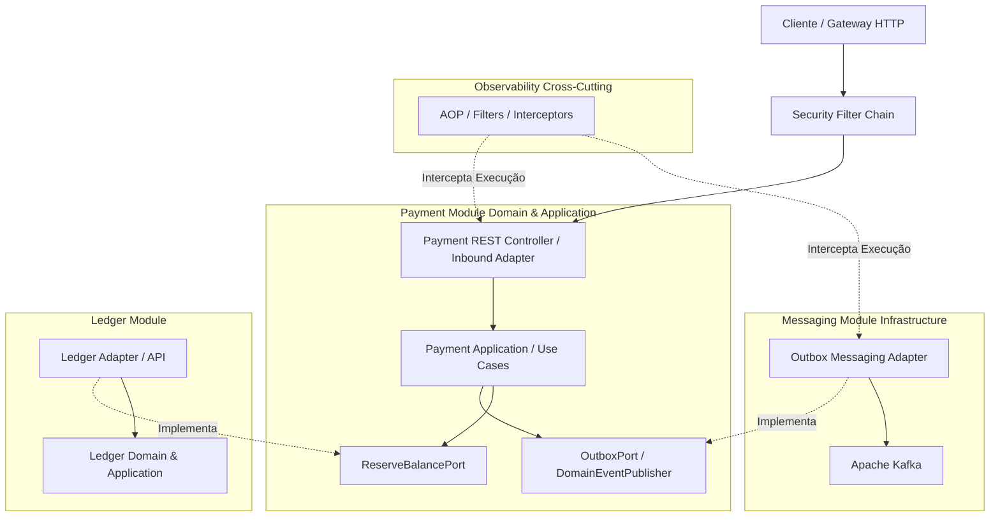

# Mapa de Módulos (Module Map) — Vortex Engine

---

## 1. Visão Geral

O **Module Map** define o mapa oficial de arquitetura e delimitação de contextos do monólito modular da **Vortex** (ADR-001). 

Os módulos existem para isolar responsabilidades de negócio e infraestrutura, garantindo **limites explícitos de contexto (*Bounded Contexts*)**, **testabilidade independente** e **baixo acoplamento**. 

A arquitetura adota rigorosamente a **Arquitetura Hexagonal (Ports & Adapters)**:
* O **núcleo de negócio (Domain/Application)** de cada módulo é agnóstico a frameworks e infraestruturas externas.
* A comunicação entre o núcleo de negócio e recursos externos (banco de dados, brokers de mensagens, outros módulos) ocorre **exclusivamente através de portas (Interfaces/Ports)**.
* Módulos de infraestrutura e utilitários atuam como **adaptadores de entrada ou saída**, ou como camadas de interceptação na borda da aplicação.

---

## 2. Lista dos Módulos

### `payment`

* **Responsabilidade:**
  * Iniciar transações de pagamento
  * Validar regras de negócio do ciclo de pagamento
  * Controlar os estados e transições de pagamento (`PENDING`, `APPROVED`, `FAILED`, `CANCELLED`)
* **Entradas:**
  * `CreatePaymentCommand` / `CancelPaymentCommand` (via Adaptador REST de entrada)
* **Saídas:**
  * `OutboxPort` / `DomainEventPublisher` (Porta de saída para registro de eventos do domínio)
  * `ReserveBalancePort` (Porta de saída para integração com o motor contábil)

### `ledger`

* **Responsabilidade:**
  * Gestão e integridade de contas financeiras
  * Reserva preventiva de saldo
  * Lançamentos contábeis imutáveis de débito e crédito (*double-entry bookkeeping*)
* **Entradas:**
  * `ReserveBalancePort` (Porta de entrada exposta para verificação e reserva de saldo)
  * `PostLedgerEntryPort` (Porta de entrada para lançamentos definitivos)
* **Saídas:**
  * `OutboxPort` / `DomainEventPublisher` (Porta de saída para emissão de eventos contábeis)

### `messaging`

* **Responsabilidade:**
  * Implementação concreta de infraestrutura para persistência durável via **Transactional Outbox**
  * Message Relay (worker de varredura e despacho de eventos)
  * Publicação e consumo de mensagens no Apache Kafka
  * Gestão de *Consumers* e tratamento de reprocessamento / *Dead Letter Queue* (DLQ)
* **Entradas:**
  * Implementa a interface `OutboxPort` / `DomainEventPublisher` (Porta de Saída do Domínio)
  * Tópicos do Apache Kafka
* **Saídas:**
  * Envio de mensagens para o broker Apache Kafka
  * Invocação de *Event Handlers* internos registrados

### `observability`

* **Responsabilidade:**
  * Infraestrutura transversal **invisível ao domínio**
  * Injeção e propagação de `Correlation-ID` e `Trace-ID` em requisições HTTP e mensagens assíncronas
  * Coleta automática de métricas operacionais/de sistema (Prometheus/Micrometer) e rastreamento distribuído (OpenTelemetry)
* **Mecanismo de Atuação:**
  * Atua via **Filtros HTTP**, **Interceptores Spring/Kafka**, **AOP (Aspect-Oriented Programming)** e **Instrumentação**.
  * **O domínio/aplicação nunca importa ou invoca este módulo diretamente.**

### `security`

* **Responsabilidade:**
  * Proteção da borda da aplicação
  * Autenticação via tokens JWT / OAuth2
  * Validação de assinatura, expiração e autorização baseada em escopos/roles
  * População do contexto de segurança da requisição (`TenantId`, `UserId`)
* **Mecanismo de Atuação:**
  * Atua na **camada de transporte/borda (HTTP Filter Chain)** antes que a requisição chegue aos controladores/adaptadores do módulo `payment`.
  * **O domínio de negócio sequer sabe que tokens JWT ou HTTP existem.**

---

## 3. Dependências e Fluxo Arquitetural (Hexagonal)

A comunicação entre camadas e módulos respeita a Inversão de Dependência. Módulos de domínio conhecem apenas **Portas (Interfaces)**, e os módulos de infraestrutura implementam ou interceptam essas portas:

### Explicação do Fluxo:
1. **Segurança na Borda:** A requisição chega via HTTP e passa pela `SecurityFilter`. Se válida, atinge o `PaymentInbound` (Adaptador de entrada).
2. **Payment Não Conhece Messaging:** Ao criar um pagamento, o `PaymentApp` grava o evento chamando a interface `OutboxPort`. O módulo `messaging` fornece a implementação concreta (`MessagingAdapter`) dessa porta.
3. **Payment Não Conhece Detalhes de Contabilidade:** `PaymentApp` consome a interface `ReserveBalancePort`. O módulo `ledger` fornece a implementação dessa interface.
4. **Observabilidade Transparente:** Métricas de tempo de resposta, contagem de erros e rastreamento distribuído são capturados por aspectos e interceptores da infraestrutura sem poluir o código do domínio com chamadas como `MetricRegistry.increment()`.

---

## 4. Eventos Publicados

| Evento de Domínio | Módulo Origem | Consumidor(es) Conhecidos |
| :--- | :--- | :--- |
| `PaymentCreatedEvent` | `payment` | `ledger` (inicia validação e reserva de saldo) |
| `PaymentApprovedEvent` | `payment` | Notificações externas / Webhooks via Kafka |
| `PaymentFailedEvent` | `payment` | `ledger` (cancela/libera eventuais reservas) |
| `BalanceReservedEvent` | `ledger` | `payment` (confirma disponibilidade para aprovação) |
| `BalanceReservationFailedEvent` | `ledger` | `payment` (notifica falha por saldo insuficiente) |
| `BalanceReleasedEvent` | `ledger` | `payment` (confirma conclusão de estorno/cancelamento) |

---

## 5. Dono de Cada Agregado

| Agregado / Entidade Raiz | Módulo Proprietário |
| :--- | :--- |
| `Payment` | `payment` |
| `PaymentIntent` | `payment` |
| `Account` | `ledger` |
| `LedgerEntry` | `ledger` |
| `OutboxEvent` | `messaging` |

---

## 6. Dono das Tabelas no Banco de Dados

| Tabela no Banco de Dados | Módulo Proprietário |
| :--- | :--- |
| `payments` | `payment` |
| `payment_intents` | `payment` |
| `accounts` | `ledger` |
| `ledger_entries` | `ledger` |
| `outbox_events` | `messaging` |

---

## 7. Fronteiras

* **Proibido Acesso Direto a Tabelas de Outros Módulos:** Operações de leitura/escrita e `JOINs` entre tabelas de módulos diferentes são estritamente proibidas.
* **Proibida Invocação de Infraestrutura no Domínio:** Nenhuma classe do núcleo de negócio (`domain`) pode importar anotações ou classes de frameworks (Spring, JPA/Hibernate, Kafka, Micrometer).
* **Acesso Síncrono Exclusivamente por Portas:** Qualquer comunicação direta entre módulos em memória deve utilizar interfaces (Ports) do pacote público do módulo chamado.

---

## 8. Comunicação Entre Módulos

Para evitar ambiguidades sobre quando usar chamadas síncronas em memória ou eventos assíncronos, aplica-se a seguinte matriz de decisão:

| Cenário / Necessidade | Tipo de Comunicação | Mecanismo Utilizado |
| :--- | :--- | :--- |
| **Precisa de resposta imediata na mesma transação** *(Ex: Verificar e reservar saldo antes de prosseguir)* | **Síncrona** | Chamada via Porta / Interface Java em memória |
| **Apenas notificar outros contextos sobre algo que ocorreu** *(Ex: Pagamento foi aprovado)* | **Assíncrona** | Evento de Domínio via `OutboxPort` |
| **Consistência eventual é suficiente para o fluxo** *(Ex: Atualização de métricas/notificação de cliente)* | **Assíncrona** | Evento de Domínio via Apache Kafka |
| **Consulta crítica para validação rígida de estado** *(Ex: Checar se a conta financeira existe e está ativa)* | **Síncrona** | Chamada de leitura via Porta / Interface Java |

---

## 9. Dependências Proibidas

Abaixo estão listadas explicitamente as importações e acoplamentos que são **estritamente proibidos** na aplicação e que serão validados de forma automatizada no CI/CD via **ArchUnit**:

### Módulo `payment`
* **NUNCA** importa classes concretas de infraestrutura (ex: `JpaPaymentRepository`, `KafkaTemplate`).
* **NUNCA** importa pacotes de `messaging` (ex: `org.vortex.messaging.*`).
* **NUNCA** importa pacotes de `observability` ou ferramentas de métricas (ex: `io.micrometer.*`).

### Módulo `ledger`
* **NUNCA** importa entidades, agregados ou DTOs do módulo `payment` (ex: `Payment`, `PaymentEntity`).
* **NUNCA** acessa diretamente a tabela `payments` ou `payment_intents`.

### Módulo `messaging`
* **NUNCA** importa conceitos ou agregados do domínio de negócio (ex: `Account`, `Payment`, `LedgerEntry`).
* **NUNCA** contém lógica ou regras de validação financeira.

### Camada de Domínio (`domain` de qualquer módulo)
* **NUNCA** importa pacotes do Spring Framework (`org.springframework.*`).
* **NUNCA** importa especificação de persistência (`jakarta.persistence.*`).
* **NUNCA** importa bibliotecas de segurança (ex: `org.springframework.security.*`, `com.auth0.jwt.*`).
