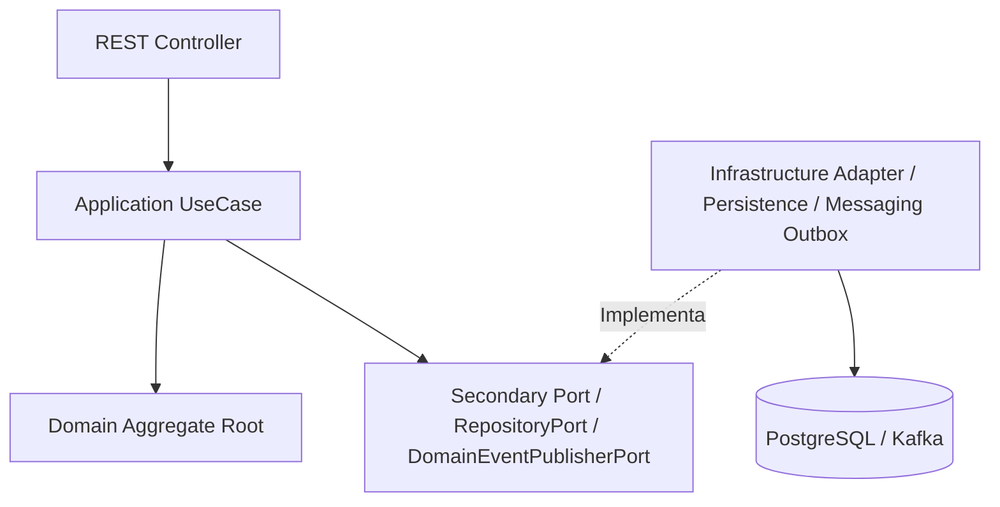

# Estrutura de Módulos (Module Structure) — Vortex Engine

---

## 1. Visão Geral

Este documento estabelece o padrão oficial de organização interna do código para todos os módulos da **Vortex**. Ele atua como a constituição estrutural da aplicação, garantindo que a **Arquitetura Hexagonal (Ports & Adapters)** e os princípios do **Domain-Driven Design (DDD)** sejam aplicados uniformemente em qualquer contexto delimitado (*Bounded Context*).

Cada módulo é autossuficiente e isolado em três camadas bem definidas:

1. **`domain` (Núcleo do Negócio):** Regras, entidades, agregados e eventos. Puramente Java 21, sem qualquer dependência de frameworks.
2. **`application` (Orquestração e Contratos):** Casos de uso, DTOs de aplicação e Portas (Interfaces de entrada e saída).
3. **`infrastructure` (Adaptadores e Frameworks):** Adaptadores REST, persistência (JPA/Hibernate), mensageria (Kafka/Outbox) e configurações do Spring Boot.

---

## 2. API Pública e Shared Kernel

### 2.1. API Pública do Módulo
Cada módulo possui uma API pública estritamente delimitada. Apenas as interfaces e objetos contidos nos pacotes listados abaixo podem ser acessados ou importados por outros módulos da aplicação:

* **`application.port.in`:** Interfaces que definem os casos de uso executáveis do módulo.
* **`application.dto`:** Contratos de entrada e saída (Commands, Queries, DTOs) consumidos pelas portas.
* **`domain.event`:** Eventos de Domínio expostos para integração assíncrona entre contextos.

**Regra de Ouro:** Qualquer outra classe ou pacote dentro de um módulo (como `domain.model`, `application.usecase`, `infrastructure.*`) é considerado **implementação interna e privada**. O acesso externo a estes pacotes é proibido e será bloqueado via testes de arquitetura.

### 2.2. Shared Kernel (`shared`)
Conceitos globais e tipos primitivos utilitários que precisam ser compartilhados por múltiplos módulos residem em um pacote especial de núcleo compartilhado (**Shared Kernel**).

Os módulos podem depender do **Shared Kernel**, mas o **Shared Kernel** não depende de nenhum módulo da aplicação.

Estrutura do Shared Kernel (`org.vortex.shared`):

```text
shared
├── domain
│   ├── money
│   ├── id
│   ├── event
│   └── tenant
└── infrastructure
    ├── clock
    └── correlation
```

---

## 3. Árvore de Diretórios Padrão

A estrutura abaixo deve ser seguida rigorosamente dentro do pacote base de cada módulo (ex: `org.vortex.payment`, `org.vortex.ledger`):

```text
<module-name>
│
├── domain
│   ├── model
│   ├── valueobject
│   ├── event
│   ├── exception
│   └── service
│
├── application
│   ├── usecase
│   ├── port
│   │   ├── in
│   │   └── out
│   └── dto
│
├── infrastructure
│   ├── adapter
│   │   ├── in
│   │   │   └── rest
│   │   │       ├── dto
│   │   │       └── mapper
│   │   └── out
│   │       ├── persistence
│   │       │   ├── entity
│   │       │   ├── repository
│   │       │   └── mapper
│   │       ├── messaging
│   │       └── external
│   │
│   └── configuration
│
└── package-info.java
```

---

## 4. Detalhamento das Camadas e Subpacotes

### 4.1. Camada `domain`

É o coração do negócio. Contém as regras de negócio puras e invariantes do módulo.

* **`model/`:** Contém as entidades e agregados (*Aggregate Roots*). Ex: `Payment.java`, `Account.java`.
* **`valueobject/`:** Objetos de valor imutáveis que expressam conceitos do domínio. Ex: `Money.java`, `PaymentStatus.java`, `AccountId.java`.
* **`event/`:** Eventos de Domínio que representam fatos ocorridos no passado. Devem ser imutáveis (Java `record`). Ex: `PaymentCreatedEvent.java`.
* **`exception/`:** Exceções de negócio lançadas pelas entidades ou serviços de domínio. Ex: `InsufficientBalanceException.java`.
* **`service/`:** Serviços de Domínio. Um **Domain Service** deve existir apenas quando uma regra de negócio não pertence naturalmente a um único Aggregate ou Value Object. Serviços de domínio não devem atuar como orquestradores de casos de uso nem encapsular lógica de infraestrutura. Ex: `PaymentValidationService.java`.

### 4.2. Camada `application`

Responsável por orquestrar o fluxo de execução dos casos de uso e definir as interfaces de comunicação com o mundo externo.

* **`usecase/`:** Casos de uso da aplicação responsáveis por coordenar o fluxo de negócio, controlar transações e orquestrar a interação entre o domínio e as portas de saída. É o local exclusivo onde reside o controle transacional (`@Transactional`).
* **`port/in/`:** Interfaces das portas de entrada (*Primary Ports*). Definem como o mundo externo interage com o módulo. Ex: `CreatePaymentUseCase.java`.
* **`port/out/`:** Interfaces das portas de saída (*Secondary Ports*). Definem os contratos necessários para guardar dados ou publicar eventos de forma agnóstica à tecnologia. Ex: `PaymentRepositoryPort.java`, `DomainEventPublisherPort.java`.
* **`dto/`:** Objetos de transferência de dados (*Commands*, *Queries*, *Responses*) utilizados pelas portas de entrada e saída.

### 4.3. Camada `infrastructure`

Contém os detalhes tecnológicos, frameworks, conexões de rede e bibliotecas externas.

* **`adapter/in/rest/`:** Adaptador de entrada HTTP.
  * `dto/`: DTOs de requisição e resposta REST (`CreatePaymentRequest`, `PaymentResponse`).
  * `mapper/`: Conversores entre DTOs REST e Commands da aplicação (`PaymentRestMapper`).
* **`adapter/out/persistence/`:** Adaptador de saída para banco de dados relacional.
  * `entity/`: Entidades JPA mapeadas para o banco de dados (`PaymentEntity`).
  * `repository/`: Interfaces estendidas do Spring Data JPA (`SpringDataJpaPaymentRepository`).
  * `mapper/`: Conversores entre Entidades JPA e Agregados de Domínio (`PaymentPersistenceMapper`).
* **`adapter/out/messaging/`:** Adaptador de saída para publicação de eventos. É onde reside a implementação concreta da infraestrutura de mensageria, como a gravação na tabela de **Transactional Outbox** ou envio direto ao broker (Kafka, SQS, NATS).
* **`adapter/out/external/`:** Adaptador de saída para comunicação HTTP/gRPC com serviços externos de terceiros.
* **`configuration/`:** Classes anotadas com `@Configuration` do Spring Boot, responsáveis por registrar Beans e definir configurações específicas do módulo.

---

## 5. Diagrama de Dependências entre Pacotes

O fluxo de dependências respeita estritamente a Inversão de Dependência da Arquitetura Hexagonal. Os componentes de borda dependem dos casos de uso, que dependem das abstrações (portas) e do domínio:



---

## 6. Ciclo de Vida de uma Requisição

Abaixo está o fluxo completo que uma requisição percorre desde a entrada na aplicação até a gravação e emissão de eventos:

```text
HTTP Request
     ↓
REST Controller (infrastructure.adapter.in.rest)
     ↓
RestMapper (converte REST DTO -> Command)
     ↓
CreatePaymentCommand
     ↓
CreatePaymentUseCase (application.usecase) [@Transactional]
     ↓
Aggregate Root (domain.model) [Executa regra de negócio e registra Domain Event]
     ↓
PaymentRepositoryPort (application.port.out)
     ↓
Persistence Adapter (infrastructure.adapter.out.persistence)
     ↓
PersistenceMapper (converte Agregado -> Entity JPA)
     ↓
PostgreSQL (Gravação da Entidade)
     ↓
DomainEventPublisherPort (application.port.out)
     ↓
Messaging Adapter / Outbox Adapter (infrastructure.adapter.out.messaging)
     ↓
Tabela Outbox / Broker Kafka
```

---

## 7. Delimitação de Responsabilidades Críticas

### 7.1. Onde Ficam as Transações (`@Transactional`)
O gerenciamento declarativo de transações pertence **exclusivamente à camada de aplicação**, mais especificamente nas classes de implementação dos Casos de Uso (`application.usecase`). 

* **Proibido no Domínio:** A anotação `@Transactional` nunca deve estar no pacote `domain`. O domínio é agnóstico a gerenciadores de transação.
* **Proibido em Adaptadores/Controllers:** Controllers REST e adaptadores de entrada não devem gerenciar transações.

### 7.2. Quem Pode Criar Eventos de Domínio e como Publicá-los
**Somente o Agregado Raiz (*Aggregate Root*)** possui a responsabilidade e a autoridade para gerar e registrar Eventos de Domínio (`DomainEvent`).

* A criação de um evento representa um fato que ocorreu com o estado do agregado após a aplicação de uma regra de negócio. Controllers, Mappers ou UseCases **nunca** devem instanciar eventos diretamente.
* A aplicação conhece apenas a porta de saída de publicação de eventos (`DomainEventPublisherPort`). A estratégia de persistência ou despacho do evento (seja via Transactional Outbox, SQS, NATS ou Kafka) é um detalhe de infraestrutura do adaptador em `infrastructure.adapter.out.messaging`.

---

## 8. Mapeamento dos Componentes Chave

| Componente de Código | Pacote de Destino | Responsabilidade / Tecnologias |
| :--- | :--- | :--- |
| **Controllers REST** | `infrastructure.adapter.in.rest` | Receber chamadas HTTP, validar schema e invocar a `port.in` |
| **Mappers REST** | `infrastructure.adapter.in.rest.mapper` | Converter DTOs HTTP para Commands de Aplicação |
| **Casos de Uso** | `application.usecase` | Coordenar o fluxo, controlar transações (`@Transactional`) e orquestrar domínio/portas |
| **Porta de Entrada (In)** | `application.port.in` | Interface pública do caso de uso |
| **Porta de Saída (Out)** | `application.port.out` | Interfaces de saída (ex: `PaymentRepositoryPort`, `DomainEventPublisherPort`) |
| **Agregados / Entidades** | `domain.model` | Aplicar regras de negócio e gerar Eventos de Domínio |
| **Serviços de Domínio** | `domain.service` | Regras puras que envolvem múltiplos Agregados |
| **Value Objects** | `domain.valueobject` | Garantir imutabilidade e validações de atributos |
| **Eventos de Domínio** | `domain.event` | Notificar fatos ocorridos no domínio (Java Records) |
| **Entidades JPA** | `infrastructure.adapter.out.persistence.entity` | Mapeamento relacional de tabelas (`@Entity`, `@Table`) |
| **Spring Data Repositories** | `infrastructure.adapter.out.persistence.repository` | Interfaces nativas do Spring Data JPA |
| **Mappers de Persistência** | `infrastructure.adapter.out.persistence.mapper` | Converter Agregados do Domínio para Entidades JPA |
| **Adaptador de Persistência** | `infrastructure.adapter.out.persistence` | Implementação concreta de `RepositoryPort` |
| **Adaptador de Mensageria** | `infrastructure.adapter.out.messaging` | Implementação concreta de `DomainEventPublisherPort` (ex: Outbox/Kafka) |
| **Configurações Spring** | `infrastructure.configuration` | Injeção de dependências e configuração de Beans |

---

## 9. Anti-Patterns e Práticas Proibidas

Para manter a integridade da arquitetura, a lista abaixo contém violações graves de design que são **estritamente proibidas** no código fonte e serão validadas via testes automatizados (ArchUnit):

* **Chamar `JpaRepository` diretamente no UseCase:** O UseCase deve interagir exclusivamente com a `port.out` (ex: `PaymentRepositoryPort`).
* **Usar anotações do JPA (`@Entity`, `@Table`, `@Column`) no Domínio:** As classes do pacote `domain` devem conter apenas código Java puro.
* **Usar `@Transactional` na camada de Domínio:** O controle transacional é uma preocupação da camada de aplicação/infraestrutura.
* **Usar clientes ou conceitos de infraestrutura de mensageria (`KafkaTemplate`, `OutboxPort`, `SQSClient`) no Domínio ou Aplicação:** O Domínio e a Aplicação enxergam apenas `DomainEventPublisherPort`.
* **Acessar ou retornar Entidades JPA (`@Entity`) em Controllers REST:** Controllers operam apenas com DTOs REST. Entidades JPA são restritas ao adaptador de persistência.
* **Retornar Entidades JPA pela API externa:** A exposição direta de estruturas de banco vaza detalhes de infraestrutura e quebra o encapsulamento.
* **Usar DTOs REST no Domínio ou na Aplicação:** O Domínio e os UseCases utilizam seus próprios Commands e Value Objects.
* **Colocar regras de negócio em Controllers REST ou Adaptadores:** A lógica de decisão e validação de negócio deve residir exclusivamente nas Entidades e Serviços de Domínio.
* **Instanciar Eventos de Domínio fora do Agregado Raiz:** Apenas a Entidade Raiz tem autoridade para emitir eventos relacionados às suas mudanças de estado.
