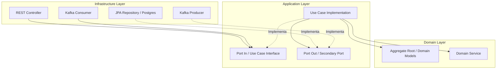

# ADR-004: Adoção da Arquitetura Hexagonal (Ports & Adapters)

* **Status:** Aceito
* **Data:** 27 de Julho de 2026
* **Decisores:** Time de Arquitetura e Engenharia Vortex Engine
* **Contexto Técnico:** Monólito Modular (ADR-001) / Java 21 / Spring Boot 3.x

---

## 1. Contexto e Problema

A **Vortex Engine** é um sistema crítico para processamento financeiro e de pagamentos. Sistemas desse domínio exigem alta auditabilidade, integridade transacional, testabilidade rigorosa e capacidade de evolução tecnológica sem impactos nas regras de negócio.

Historicamente, aplicações enterprise adotam a **Arquitetura em Camadas Tradicional** (Controller $\rightarrow$ Service $\rightarrow$ Repository). No entanto, essa abordagem apresenta falhas estruturais graves ao longo do ciclo de vida de sistemas complexos:

1. **Acoplamento Direcionado ao Banco de Dados:** A camada de serviços frequentemente se acopla a entidades anemiadas gerenciadas por ORMs (JPA/Hibernate), fazendo com que o modelo de dados relacional dite as regras de negócio em vez do modelo de domínio.
2. **Vazamento de Frameworks para o Núcleo:** Anotações do Spring (`@Service`, `@Transactional`), do JPA (`@Entity`, `@Table`) e de bibliotecas de transporte contaminam o código de negócio, dificultando migrações ou atualização de dependências.
3. **Testabilidade Lenta e Complexa:** Testar regras de negócio passa a exigir a subida do contexto do Spring (`@SpringBootTest`) ou Mocks complexos de infraestrutura, tornando a suíte de testes lenta e frágil.

---

## 2. Decisão

Decidimos adotar a **Arquitetura Hexagonal (Ports & Adapters)** como o padrão arquitetural obrigatório para a estruturação de todos os módulos do monólito modular da **Vortex Engine**.

Toda a lógica de negócio e orquestração de casos de uso deve residir no centro da aplicação, totalmente desacoplada de detalhes tecnológicos de infraestrutura, bancos de dados, brokers de mensageria e frameworks de transporte HTTP.

---

## 3. Justificativa: Por que Hexagonal e não Layered Architecture?

| Critério | Arquitetura em Camadas Tradicional | Arquitetura Hexagonal (Ports & Adapters) |
| :--- | :--- | :--- |
| **Direção das Dependências** | Top-Down (Controller $\rightarrow$ Service $\rightarrow$ Database). O banco é o centro. | Invertida em direção ao centro (Adapters $\rightarrow$ Ports $\rightarrow$ Domain). O negócio é o centro. |
| **Persistência** | O Domínio depende de abstrações e entidades do ORM (JPA). | O Domínio é agnóstico. A persistência é mero detalhe de um adaptador de saída. |
| **Testabilidade** | Testes de unidade exigem mocks de repositories/frameworks ou subida do ecossistema Spring. | Regras de negócio são testadas com Java puro em milissegundos, sem frameworks. |
| **Substituibilidade** | Trocar um banco relacional, broker ou cliente HTTP impacta a camada de serviços. | Trocar componentes de infraestrutura exige apenas a implementação de um novo Adaptador. |

---

## 4. Princípios Fundamentais

### 4.1. Inversão de Dependência e Isolamento do Domínio
A regra fundamental da Arquitetura Hexagonal determina que **as dependências de código sempre apontam para dentro**. 

* O módulo de **Domínio (`domain`)** não possui dependências externas. Ele é composto exclusivamente por código Java puro (JDK 21), sem qualquer importação do Spring, JPA, Jackson ou Kafka.
* A camada de **Aplicação (`application`)** conhece apenas o Domínio e define as interfaces (Ports) necessárias para comunicação externa.
* A camada de **Infraestrutura (`infrastructure`)** reside na borda externa e depende das camadas internas.

---

## 5. Definições Técnicas: Ports In vs. Ports Out

A comunicação entre o núcleo da aplicação e o mundo externo ocorre exclusivamente por **Portas (Ports)**, que são interfaces Java puras declaradas na camada de Aplicação (`application.port`).

### 5.1. Ports In (Portas de Entrada / Primary / Driving Ports)
* **Definição:** Interfaces que declaram os casos de uso executáveis da aplicação. Definem **o que** o mundo externo pode solicitar ao sistema.
* **Localização:** `application.port.in`
* **Quem Invoca:** Adaptadores de Entrada (ex: Controllers REST, Consumers do Kafka, Jobs agendados).
* **Exemplo:** `CreatePaymentUseCase.java`, `CancelPaymentUseCase.java`.

### 5.2. Ports Out (Portas de Saída / Secondary / Driven Ports)
* **Definição:** Interfaces que declaram os contratos de recursos que a aplicação necessita para cumprir seus casos de uso, mas cujas implementações dependem de tecnologia externa.
* **Localização:** `application.port.out`
* **Quem Invoca:** Os Casos de Uso (`application.usecase`).
* **Quem Implementa:** Adaptadores de Saída (ex: `PaymentPersistenceAdapter`, `KafkaMessagingAdapter`).
* **Exemplo:** `PaymentRepositoryPort.java`, `DomainEventPublisherPort.java`.

---

## 6. O Domínio Agnóstico

O pacote `domain` de qualquer módulo é estritamente isolado de frameworks e tecnologias.

### O Domínio É Proibido De:
1. **Importar anotações do Spring:** `@Service`, `@Component`, `@Autowired`, `@Value`, `@Transactional`.
2. **Importar anotações de persistência/ORM:** `@Entity`, `@Table`, `@Column`, `@Id`, `@Enumerated`.
3. **Importar bibliotecas de serialização ou transporte:** `com.fasterxml.jackson.*`, `jakarta.servlet.*`, `org.springframework.web.*`.
4. **Importar clientes de mensageria:** `KafkaTemplate`, `SqsClient`, `RabbitTemplate`.

### O Domínio Pode Utilizar Apenas:
* Tipos nativos do Java 21 (`java.util.*`, `java.time.*`, `java.math.*`).
* Records, Enums, Interfaces e Classes do próprio pacote `domain` ou do `shared` kernel.

---

## 7. Relação com o Spring Boot (Alinhamento com ADR-003)

O Spring Boot é tratado na Vortex Engine estritamente como um **framework de infraestrutura e container de Injeção de Dependências (IoC)**, e não como o pilar da arquitetura de negócio.

1. **Injeção de Dependência:** O Spring é responsável por instanciar os Beans e conectar os Adaptadores de Infraestrutura às Portas de Saída e Entrada através do pacote `infrastructure.configuration`.
2. **REST e HTTP:** O Spring MVC opera exclusivamente dentro de `infrastructure.adapter.in.rest` como um adaptador de entrada.
3. **Persistência e Transações:** O Spring Data JPA e a anotação `@Transactional` atuam no gerenciamento das transações na camada de aplicação/infraestrutura, sem contaminar os objetos de domínio.

---

## 8. Consequências

### Positivas
* **Testabilidade de Altíssimo Desempenho:** Testes de unidade do domínio e casos de uso executam em milissegundos sem necessidade de iniciar o Spring Boot Test Context.
* **Independência Tecnológica:** Possibilidade de trocar o banco de dados, bibliotecas de mensageria ou componentes web sem alterar uma única linha de regra de negócio.
* **Barreira Rígida Contra Débito Técnico:** Impedimento estrutural de vazamento de queries SQL, requisições HTTP e lógicas de framework para o modelo de domínio.
* **Fácil Manutenibilidade:** Regras de negócio centralizadas e legíveis no domínio, isoladas de detalhes mecânicos de infraestrutura.

### Negativas / Trade-offs
* **Verbosidade e Quantidade de Classes:** Exige a criação de Mappers e DTOs dedicados para cada camada (REST DTO, Command, Aggregate, JPA Entity).
* **Curva de Aprendizado Inicial:** Exige disciplina da equipe para não atalhar portas e mappers durante a implementação de novos fluxos.
* **Custo de Mapeamento:** Sobrecarga computacional irrelevante, porém existente, na conversão de objetos entre camadas (`DTO -> Command -> Aggregate -> Entity`).

---

## 9. Validação Automatizada

Para garantir que a decisão expressa neste ADR seja cumprida e mantida ao longo do tempo, as regras de dependência entre pacotes e o isolamento do domínio serão validados em cada build de CI/CD através do **ArchUnit**. Qualquer violação importando infraestrutura dentro do domínio resultará na falha imediata da esteira.
